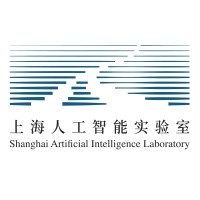








I am currently a third-year Master's Student at the School of Data Science and Engineering, East China Normal University, under the supervision of Prof. Ming Gao and [Prof. Xiang Li](https://lixiang3776.github.io/) in the X101 lab. I am currently a research intern at Shanghai AI LAB, supervised by [Dr. Zhiyong Wu](https://lividwo.github.io/zywu.github.io/).

My research interests include:
- **Large Language Models:** applications in scientific research, knowledge editing;
- **AI Agent:** OS Agent, GUI Agent, GUI foundation model.
<!-- My research interests include data mining, especially graph mining. The research work I have been involved in encompasses heterogeneous graph mining and weakly supervised learning on graphs. -->
<!-- Currently I am exploring the integration of Large Language Models (LLMs) with Graph Neural Networks (GNNs). -->

<!-- https://scholar.google.com.hk/citations?user=EH6ntM0AAAAJ&hl=zh-CN&oi=ao -->

🎉🎉🎉 Feel free to reach out to me for academic discussions and collaborations!

<!-- # 🔥 News -->
<!-- - *2022.02*: &nbsp;🎉🎉 Lorem ipsum dolor sit amet, consectetur adipiscing elit. Vivamus ornare aliquet ipsum, ac tempus justo dapibus sit amet. 
- *2022.02*: &nbsp;🎉🎉 Lorem ipsum dolor sit amet, consectetur adipiscing elit. Vivamus ornare aliquet ipsum, ac tempus justo dapibus sit amet.  -->

# 🔥 News

- 🎉 New homepage!
- *2024.11* Our paper [RELIEF](https://arxiv.org/pdf/2408.03195) is accepted to KDD 2025!
- *2024.11* Attend EMNLP 2024 in Miami, USA!



# 🎖 Honors and Awards
- *2022-2025* Graduate Academic Scholarship, East China Normal University
- *2022.06* Outstanding Graduate, Dalian University of Technology
- *2018-2022* Academic Excellence Scholarship, Dalian University of Technology
- *2021.01* Fifth Place, Microsoft Imagine Cup China Division
- *2021.01* First Place, IBM Modern Architecture Technology Elite Contest China Division

# 📖 Educations
- *2022.09 - now*   Master's, DASE, East China Normal University (via recommendation)
- *2018.09 - 2022.06*   Undergraduate, School of Software Engineering, Dalian University of Technology

<!-- # 💬 Invited Talks
- *2021.06*, Lorem ipsum dolor sit amet, consectetur adipiscing elit. Vivamus ornare aliquet ipsum, ac tempus justo dapibus sit amet. 
- *2021.03*, Lorem ipsum dolor sit amet, consectetur adipiscing elit. Vivamus ornare aliquet ipsum, ac tempus justo dapibus sit amet.  \| [\[video\]](https://github.com/) -->

# 💻 Internships
- *2023.11 - now* NLP Research Intern, NLP Group, Shanghai AI Laboratory, Shanghai, China.